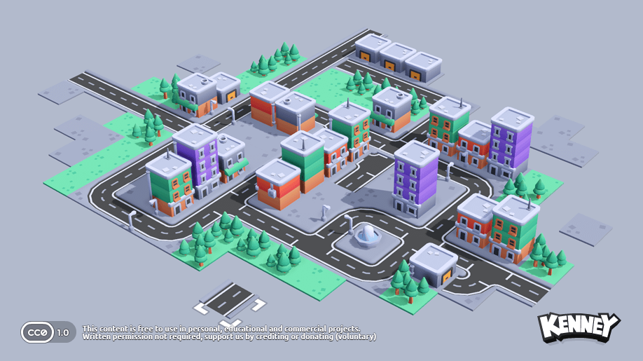

# Space Mission Constructor

  

A 3D space mission construction and management game developed for the **NASA Space Apps Challenge 2025**. Design, build, and manage your own rockets and habitats for interplanetary missions!

## About the Game

In *Space Mission Constructor*, you take on the role of a mission planner and engineer. Your goal is to successfully complete missions to the Moon and Mars by designing and building functional habitats and spacecraft. You'll need to manage your budget and resources carefully to meet the mission requirements.

The game is built using the Godot Engine and is based on the "Starter Kit City Builder" by Kenney.

## Features

-   **Mission Selection:** Choose from different missions, including missions to the Moon and Mars.
-   **Habitat and Rocket Construction:** Design and build your own habitats and rockets from various modules.
-   **Internal Layout Customization:** Customize the internal layout of each module to meet the crew's needs.
-   **Resource Management:** Manage your budget and essential supplies like food and hygiene items.
-   **3D Camera Controls:** Freely navigate and inspect your creations in a 3D environment.

### Screenshot

### Controls

| Key | Command |
| --- | --- |
| <kbd>W</kbd> <kbd>A</kbd> <kbd>S</kbd> <kbd>D</kbd> | Move camera |
| <kbd>F</kbd> | Center camera |
| <kbd>Middle mouse button</kbd> | Hold to rotate camera |
| <kbd>Scroll wheel</kbd> | Zoom |
| <kbd>Left mouse button</kbd> | Place module/item |
| <kbd>DEL</kbd> | Remove module/item |
| <kbd>Right mouse button</kbd> | Rotate module/item |
| <kbd>Q</kbd> <kbd>E</kbd>  | Cycle through modules/items |

## How to Play

1.  Launch the game and start a new mission from the main menu.
2.  Select a destination: the Moon, Mars, or Earth orbit.
3.  Use the available modules and your budget to construct a habitat or rocket that meets the mission objectives.
4.  Customize the interior of your modules to ensure your crew has everything they need.

## License

This project is built upon the "Starter Kit City Builder" template by Kenney, which is licensed under the MIT License.

**Template License (MIT):**

Copyright (c) 2025 Kenney

Permission is hereby granted, free of charge, to any person obtaining a copy of this software and associated documentation files (the "Software"), to deal in the Software without restriction, including without limitation the rights to use, copy, modify, merge, publish, distribute, sublicense, and/or sell copies of the Software, and to permit persons to whom the Software is furnished to do so, subject to the following conditions:

The above copyright notice and this permission notice shall be included in all copies or substantial portions of the Software.

THE SOFTWARE IS PROVIDED "AS IS", WITHOUT WARRANTY OF ANY KIND, EXPRESS OR IMPLIED, INCLUDING BUT NOT LIMITED TO THE WARRANTIES OF MERCHANTABILITY, FITNESS FOR A PARTICULAR PURPOSE AND NONINFRINGEMENT. IN NO EVENT SHALL THE AUTHORS OR COPYRIGHT HOLDERS BE LIABLE FOR ANY CLAIM, DAMAGES OR OTHER LIABILITY, WHETHER IN AN ACTION OF CONTRACT, TORT OR OTHERWISE, ARISING FROM, OUT OF OR IN CONNECTION WITH THE SOFTWARE OR THE USE OR OTHER DEALINGS IN THE SOFTWARE.

**Asset License:**

The 2D sprites, 3D models, and sound effects included in this project are [CC0 licensed](https://creativecommons.org/publicdomain/zero/1.0/).